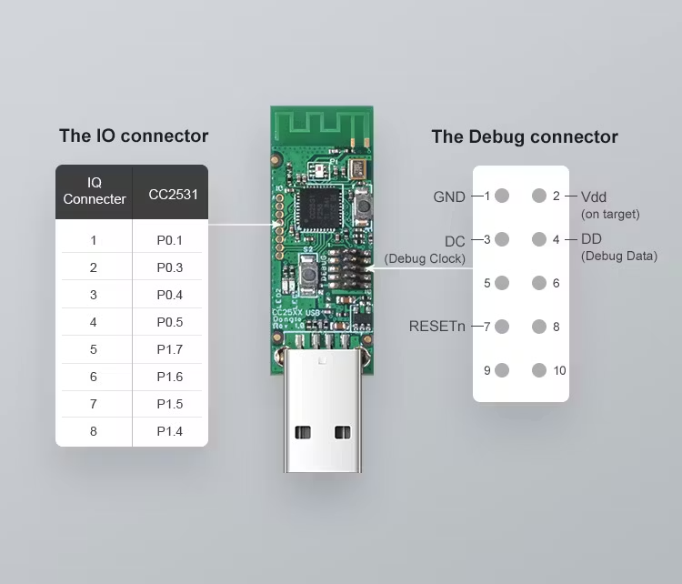

# Introduction

The CC2531 USB Dongle has a debug connector, and can be flashed only through that.  
It normally needs a TI programmer which I don't have, but I can use an ESP32 instead.

I need a firmware called "CC loader" for ESP32, which is located in here:  
https://github.com/xyzroe/XZG-MT/tree/cc_loader  
https://github.com/xyzroe/XZG-MT/blob/main/docs/how-to/cc_loader.md

# Finding the pins on the ESP32 dev board

The different ESP32 dev boards uses the GPIO pins for different purposes. 
The firmware supports a few of them, and the pins used by the FW for flashing varies. 
I can find the pins used for DD, DC, and RESET on the different boards in this file:  
https://github.com/xyzroe/XZG-MT/blob/cc_loader/bins/manifest.json 

I have an original ESP-32 in my dev board, so I search for `"chip": "ESP32"`. 
With this search criteria, I find this entry in the manifest:  
```json
{
  "filename": "CCLoader_esp32_dev_dd-16_dc-17_reset-21_led-2.bin",
  "url": "https://raw.githubusercontent.com/xyzroe/XZG-MT/cc_loader/bins/CCLoader_esp32_dev_dd-16_dc-17_reset-21_led-2.bin",
  "board": "esp32_dev",
  "chip": "ESP32",
  "pins": {
    "dd": "16",
    "dc": "17",
    "reset": "21",
    "led": "2"
  }
}
```

__16__, __17__ and __21__ means the GPIO pin IDs, but the labeling on the is different. 
I needed a more detailed description of the pin functions, so I used this picture. 
In this picture I can see that GPIO 16 and 17 are labelled as __RX2__ and __TX2__, while GPIO 21 is __D21__. 
  

# Finding the pins on the CC2531 board

I can see the DD, DC and RESET pins of rhe CC2531 Dongle in this PNG image:
  
Instead of connecting the __Vpp__, I will just plug in the dongle to the USB port, so it will have power.  
I will connect the ESP32 dev board to the same computer, so the __GND__ will also work out of the box. 

# Flasing

I can easily flash both the ESP32 and the CC2531 using the https://mt.xyzroe.cc/ tool.

## Flasing the ESP32

I select ESP as family, I press __Choose Serial__, and I select the USB-to-UART bridge. 
The __Device Info__ gets populated, and I can see that my chip is __ESP32-D0WD-V3 (revision 3)__

For the firmware I will select the file mentioned in the manifest:  
__CCLoader_esp32_dev_dd-16_dc-17_reset-21_led-2.bin__  
I press Start, and the flashing goes through smoothly. 

## Flasing the CC2531

When I select __TI CC25XX__ as Family in the tool, the UI changes. 
I see a __Connect Loader__ button, and I can select the UART port when I press it. 
After I select it, the CC2531 chip gets correctly detected:
```
[14:56:00.328] Serial selected and opened
[14:56:00.329] Waiting for Arduino loader to initialize...
[14:56:00.329] CC Loader reset: device type 0
[14:56:00.329] Setting DTR=off, RTS=off for UNO-like device
[14:56:03.399] CC Loader connected: CC2531 (ID: 0xb5, Rev: 0x24)
[14:56:03.399] IEEE Address: 00:12:4B:00:18:E8:6A:69
```

I had to install lots of CC tools to extract the sniffer firmware, so it's easier to have it here:  
 

You can download this and choose it in the __Local__ file selector in the __Firmware__ section.  
Then press __Start__, and the firmware flashing will go through smoothly. 


